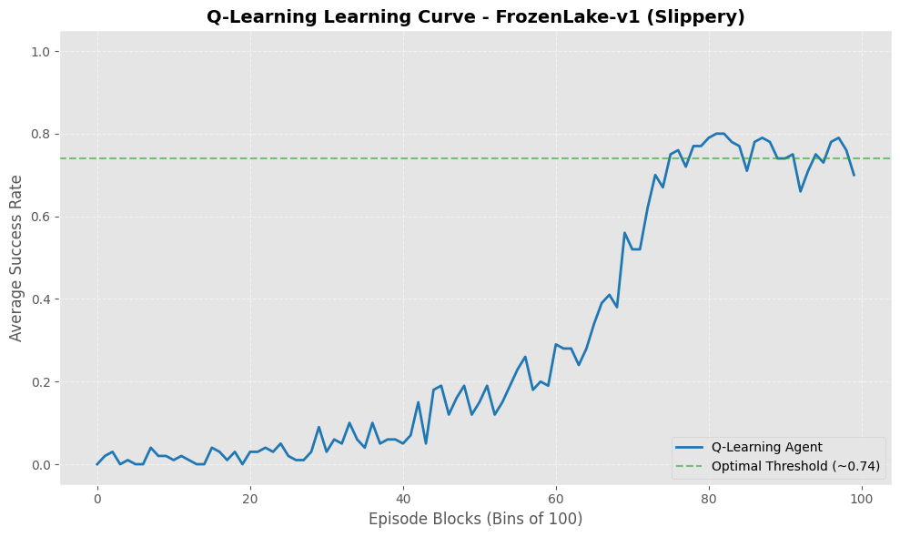

[](https://www.python.org/)

[](https://opensource.org/licenses/MIT)


# Reinforcement Learning: Solving FrozenLake-v1 with Q-Learning

This repository presents a case study on Reinforcement Learning (RL) applied to the **FrozenLake-v1** environment from the [Gymnasium](https://gymnasium.farama.org/) library. The project demonstrates the transition from a random baseline to an optimized policy using the **Q-Learning** algorithm.


## 📌 Project Overview

The goal is to navigate an agent across a 4x4 frozen lake grid from a starting point (S) to a goal (G) without falling into holes (H). This implementation focuses on the **stochastic version** (`is_slippery=True`), where actions have non-deterministic outcomes, making it a **Markov Decision Process (MDP)**.


### Key Features:
* **Algorithm selection justification:** Notes about the difference and use cases of the Policy Evaluation, Value Iteration, SARSA and Q-Learning algorithms.
* **Model-Free Approach:** Implementation of Q-Learning, an off-policy algorithm that learns without prior knowledge of environment transitions.
* **Data Analysis:** Comparative performance tracking between a Random Baseline and the Q-Learning Agent.
* **Visualization:** Learning curves and Q-Table.


## 🧠 Technical Justification: Why Q-Learning?

While algorithms like *Value Iteration* require a complete model of the environment (MDP transition probabilities), **Q-Learning** was chosen because it is **Model-Free**. It learns directly from experience through **Temporal Difference (TD) Learning**.

* **Off-Policy Advantage:** By using the `max` operator in the Bellman Equation, Q-Learning targets the optimal policy directly, which is highly effective for propagating sparse rewards in grid-world environments.
* **Exploration vs. Exploitation:** Controlled via an $\epsilon$-greedy strategy with exponential decay, ensuring the agent moves from pure exploration to optimal behavior.


## 📊 Results and Performance

The agent's progress is monitored by averaging rewards over bins of 100 episodes. In the stochastic FrozenLake environment, a success rate near **0.8** indicates that the agent has reached the **Optimal Policy ($\pi^*$)**, as a 1.0 success rate is mathematically impossible due to the ice's slipperiness.



*The plot above illustrates the learning curve, showing the convergence after approximately 8,000 episodes.*


## 🛠️ Installation & Usage

1. **Clone the repository:**
    ```bash
    git clone https://github.com/vitor-rodovalho/reinforcement-learning-qlearning-frozenlake.git
    ```

2. **Install dependencies (if needed):**
    ```bash
    pip install gymnasium numpy matplotlib pandas tqdm 
    ```

3. **Run the Notebook:**
Open `FrozenLake_QLearning_CaseStudy.ipynb` in Jupyter or Google Colab to execute the training and see the visualizations.


---

## ⚠️ Language Note

Please note that the code comments are currently in **Portuguese**, as this project was originally developed for a university assignment.

## 📄 Author

Developed by **Vitor Hugo Rodovalho**.

---
